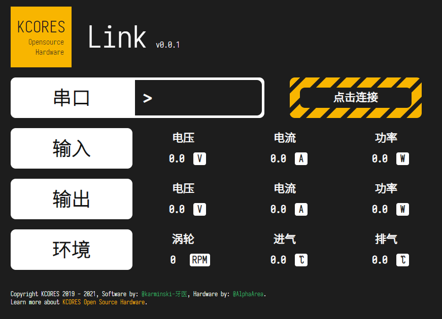

KCORES Link
-----------

# 描述

该 KCORES Link 软件是为 KCORES CSPS to ATX Converter (CSPS转ATX转换器) 而编写的软件界面, 通过接入串口通信读取CSPS输出的信息, 最终实时展示到WEB界面上.  

# 下载并运行

Windows 用户直接下载本项目, 运行 release 文件夹中的 kcores-link.exe 即可. 
MAC 和 Linux 用户自行下载代码后, 执行 srcipts/build.sh 即可编译获得特定操作系统下的可运行版本 (需要 Golang, 请自行下载).  

# Author

- [Karminski-牙医](https://github.com/karminski)

# License

[KCORES License 1.0](./license)